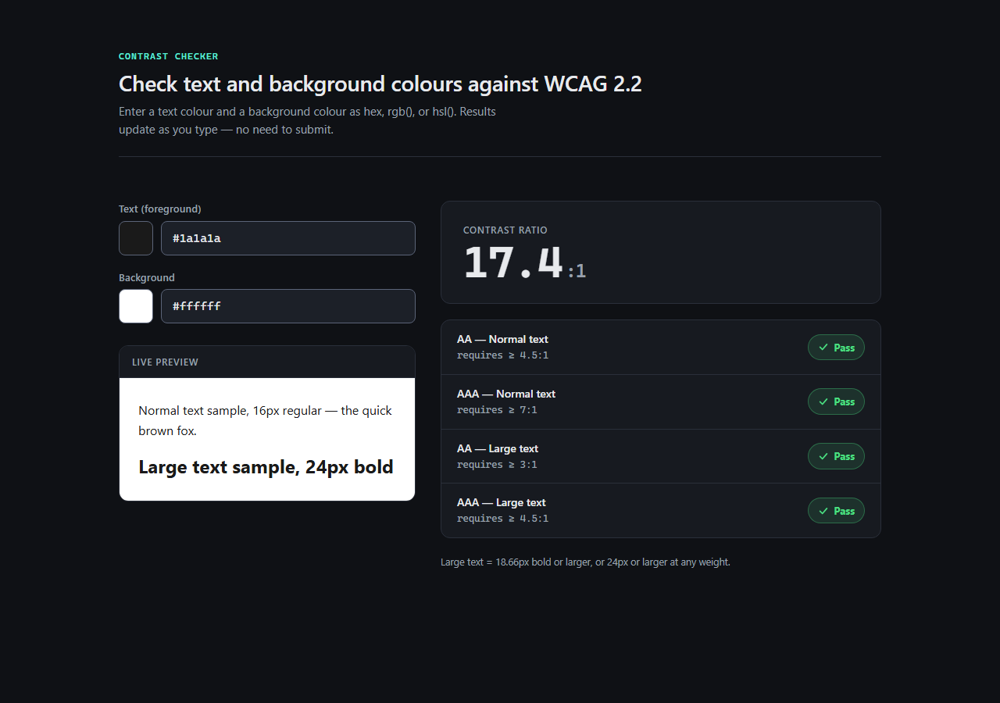

# contrast-checker

> Paste two colours, instantly see their WCAG contrast ratio and AA/AAA pass-fail.

## What it does

WCAG Contrast Checker lets you paste a text colour and a background colour and see the
WCAG 2.x contrast ratio update live as you type, with pass/fail verdicts for AA and AAA
at both normal and large text sizes. A live preview panel renders real sample text in the
chosen colours so you can see, not just read, the result. If you type an invalid colour,
the last valid result stays on screen (with a note) instead of the UI going blank.

## Supported input formats

- Hex: `#1a1a1a`, `#fff`
- `rgb(r, g, b)`
- `hsl(h, s%, l%)`

## Screenshot



## Run locally

```bash
bun install
bun run dev
```

Open http://localhost:3000.

## Testing

| Command | Does |
| --- | --- |
| `bun run test` | unit tests (Vitest) |
| `bun run test:e2e` | end-to-end tests (Playwright) |
| `bun run test:a11y` | accessibility scan (axe-core, WCAG 2.2 AA) |

Unit tests live beside the code they cover. End-to-end and accessibility specs live in
`e2e/`. Every route is scanned against WCAG 2.2 A + AA — add new routes to the `ROUTES`
array in `e2e/a11y.spec.ts`, since an unlisted route is not covered.

## Other commands

| Command | Does |
| --- | --- |
| `bun run build` | production build |
| `bun run lint` | Biome check |
| `bun run typecheck` | route typegen + tsc |

## Tech stack

Bun, Next.js App Router, TypeScript strict, Tailwind CSS v4, Biome, Vitest, Playwright.

## Deployment

Deployed on Vercel. Every pull request gets a preview build; production deploys are manual.
